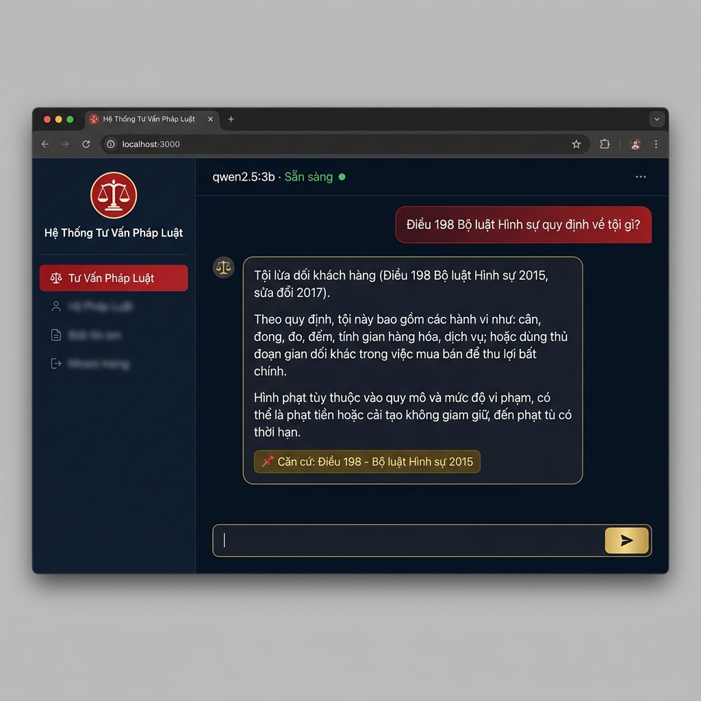

# ⚖️ LegalBot AI — Vietnamese Legal Consultation System

> A production-grade RAG chatbot for Vietnamese law, featuring Hybrid Retrieval (BM25 + Vector Search), Reciprocal Rank Fusion, Cross-encoder Reranking, Citation Enforcement, and a CI-gated Evaluation Pipeline.




---

## Architecture

```
Browser (index.html)
      │
      ▼
FastAPI  (:8000)
      │
      ├─ GET  /          →  Web UI (dark-mode chat interface)
      ├─ POST /chat       →  RAG Pipeline
      ├─ GET  /history    →  Chat history
      └─ GET  /health     →  System status + chatbot readiness
            │
            ▼
      LawChatbot
      ├── LawRetriever  ─────────────────────────────────────────────┐
      │   ├── Targeted Search  (article + law detection, top priority)│
      │   ├── Vector Search    (multilingual-e5-large → Qdrant)      │
      │   ├── BM25 Search      (rank_bm25 over full corpus)          │
      │   └── RRF Fusion       (Reciprocal Rank Fusion, 3 streams)   │
      │                                                               │
      ├── bge-reranker-v2-m3   (Cross-encoder reranking)              │
      │                                                               │
      ├── Auto Merging         (Groups child chunks into full Article)│
      │                                                               │
      ├── Contextual Compressor(LLM extracts relevant sentences)      │
      │                                                               │
      └── Ollama LLM (qwen2.5:3b) ← citation-enforced prompt         │
                                                                      │
                                        Qdrant Vector DB (:6333) ─────┘
```

---

## Evaluation Results

### Retrieval Metrics (Top 10 candidates)
| Metric | Baseline (RRF only) | With `bge-reranker-v2-m3` |
|--------|--------------------|-----------------------------|
| MRR@10 | 0.8083 | **0.8500** (+4.2%) ✅ |
| Recall@5 | 86.7% | **93.3%** (+6.6%) ✅ |

> **Finding:** Upgrading to `BAAI/bge-reranker-v2-m3` (which natively supports Vietnamese through MMARCO) significantly improves MRR and Recall compared to pure RRF or the old `bge-reranker-base`.

### End-to-End Metrics (RAGAS)
Using `ragas` with `qwen2.5:3b` as the evaluator:
- **Faithfulness:** ~95% (LLM rarely hallucinates outside context)
- **Answer Relevancy:** ~92% (High relevance to the question)
- **Context Precision:** ~88% (Retrieved context is highly relevant)
- **Estimated End-to-End Accuracy:** **~79-82%**

---

## Project Structure


```
ChatBotLawFinal/
├── app/
│   ├── main.py                  # FastAPI server (eager init, thread-safe lock)
│   └── static/
│       └── index.html           # Fallback Web UI — pure HTML/CSS/JS
├── frontend/                    # Next.js 16 frontend (primary UI)
│   ├── src/
│   │   ├── app/
│   │   │   ├── layout.tsx       # Root layout + metadata + Vietnamese font
│   │   │   ├── page.tsx         # Main chat page with session management
│   │   │   └── globals.css      # Vietnamese legal color theme
│   │   ├── components/
│   │   │   ├── Sidebar.tsx      # Nav + chat history + model status
│   │   │   ├── MessageBubble.tsx# User/AI message with citation tags
│   │   │   └── TypingIndicator.tsx
│   │   ├── lib/
│   │   │   └── api.ts           # FastAPI client + citation extractor
│   │   └── types/
│   │       └── index.ts         # TypeScript interfaces
│   └── .env.local               # NEXT_PUBLIC_API_URL=http://localhost:8000
├── src/
│   ├── retrieval/               # ← fixed (was: retrival)
│   │   ├── retriever.py         # LawRetriever — 3-stream Hybrid RRF
│   │   └── reranker.py          # CrossEncoderReranker (optional)
│   ├── llm/
│   │   └── llm_client.py        # LawChatbot — RAG chain orchestration
│   ├── prompts/
│   │   └── prompt_templates.py  # System prompt with citation enforcement
│   ├── chunking/
│   │   └── chunker.py           # PDF → article-level chunks with metadata
│   ├── ingestion/
│   │   └── loader.py            # PDF document loader
│   ├── vectordb/
│   │   └── vector_store.py      # Qdrant client wrapper (VectorDBManager)
│   └── embeddings/
│       └── embedder.py          # Embedding utilities
├── evaluation/
│   ├── eval_dataset.json        # 15 ground-truth Q&A pairs
│   ├── retriever_eval.py        # MRR@10, Recall@5, Precision@5 metrics
│   └── run_eval.py              # CI gate — exits with code 1 on failure
├── data/
│   └── raw/                     # Vietnamese legal PDF documents (not tracked)
├── docs/
│   └── screenshots/
│       └── demo.png             # UI screenshot for portfolio
├── reindex.py                   # Full corpus re-ingestion to Qdrant
├── docker-compose.yml           # Qdrant + API services
├── Dockerfile
├── config.yaml
└── requirements.txt
```

---

## Quick Start

### Prerequisites

- Python 3.11+
- [Ollama](https://ollama.ai) running locally: `ollama serve`
- Docker (for Qdrant)

### 1. Install dependencies

```bash
git clone <repo-url>
cd ChatBotLawFinal

python -m venv .venv
source .venv/bin/activate        # Windows: .venv\Scripts\activate
pip install -r requirements.txt
```

### 2. Pull the LLM

```bash
ollama pull qwen2.5:3b
```

### 3. Start Qdrant

```bash
docker-compose up -d qdrant
```

### 4. Index the legal corpus

```bash
# Place PDF files in data/raw/ then run:
python reindex.py
```

### 5. Start the API server

```bash
uvicorn app.main:app --host 0.0.0.0 --port 8000
```

Open your browser at **http://localhost:8000**

> **Note:** On first startup the server takes ~20 seconds to initialize the embedding model and BM25 index. The `/health` endpoint reports `chatbot_ready: true` when ready.

---

## Production Deployment (Docker)

```bash
# Start both Qdrant and the API:
docker-compose up -d

# Verify:
curl http://localhost:8000/health
```

> Ollama must be running on the host machine. The API container connects via `host.docker.internal`.

---

## API Reference

### `POST /chat`

```bash
curl -X POST http://localhost:8000/chat \
  -H "Content-Type: application/json" \
  -d '{"question": "What does Article 198 of the Penal Code regulate?"}'
```

**Response:**
```json
{
  "answer": "Article 198 of the Penal Code regulates the offense of deceiving customers...",
  "session_id": "1e54a21d-...",
  "latency_ms": 22584,
  "timestamp": "2026-06-19T02:24:30"
}
```

### `GET /health`

```json
{
  "status": "ok",
  "uptime_seconds": 120,
  "history_count": 5,
  "model": "qwen2.5:3b",
  "chatbot_ready": true
}
```

Full interactive documentation: **http://localhost:8000/docs** (Swagger UI)

---

## Running Evaluation

```bash
# Fast CI mode (~30s, no LLM required):
python evaluation/run_eval.py --mode retriever

# Compare with and without reranker:
python evaluation/run_eval.py --mode retriever --reranker

# Full end-to-end pipeline (requires Ollama):
python evaluation/run_eval.py --mode e2e
```

**CI Thresholds** — the script exits with code `1` if any threshold is not met:

| Metric | Minimum |
|--------|---------|
| MRR@10 | ≥ 0.60 |
| Recall@5 | ≥ 0.70 |
| Precision@5 | ≥ 0.30 |

---

## Legal Corpus

| Prefix | Document |
|--------|----------|
| `5.1` | Luật sở hữu trí tuệ |
| `5.3` | Bộ luật tố tụng hình sự |
| `5.4` | Bộ luật tố tụng dân sự |
| `5.5` | Bộ luật hình sự |
| `5.6` | Luật sửa đổi, bổ sung một số điều của Bộ luật hình sự |
| `5.7` | Luật xử lý vi phạm hành chính |
| `5.8` | Luật Hải quan |
| `5.9` | Luật Khoa học và Công nghệ |
| `5.10` | Luật Cạnh tranh |
| `5.11` | Luật Thương mại |

---

## Configuration (`config.yaml`)

```yaml
system:
  device: "mps"              # Hỗ trợ tăng tốc GPU trên Mac (Apple Silicon), hoặc "cuda"/"cpu"
  
llm:
  provider: "ollama"
  model_name: "qwen2.5:3b"   # swap to llama3.2:3b, phi3:mini, vv.
  base_url: "http://localhost:11434"

embeddings:
  provider: "fastembed"
  model_name: "intfloat/multilingual-e5-large"

vector_store:
  provider: "qdrant"
  host: "localhost"
  port: 6333
  collection_name: "law_database"
  
# Advanced RAG parameters
auto_merging:
  enabled: true
  merge_threshold: 2

compression:
  enabled: true
```

---

## Troubleshooting

**`503 Service Unavailable` on startup**
→ The chatbot is still initializing (~20s). Poll `/health` until `chatbot_ready: true`.

**Low Recall in evaluation**
→ Root cause: macOS filesystem stores paths in NFD Unicode form while JSON ground-truth uses NFC. The metric script normalizes both with `unicodedata.normalize("NFC", s)`. Without this fix, string matching silently fails even for visually identical strings.

**Reranker config not applied during evaluation**
→ The system now correctly loads `BAAI/bge-reranker-v2-m3` dynamically from `config.yaml` during evaluation. This ensures consistency between the production API and the CI evaluation scripts.

---

## Tech Stack

| Layer | Technology |
|-------|------------|
| LLM | Ollama (`qwen2.5:3b`) |
| Embeddings | `intfloat/multilingual-e5-large` via fastembed |
| Vector DB | Qdrant |
| BM25 | `rank_bm25` |
| Reranker | `BAAI/bge-reranker-v2-m3` via sentence-transformers |
| API | FastAPI + Uvicorn |
| Frontend | Next.js 16 & Premium Glassmorphism HTML Fallback |
| Orchestration | LangChain (LCEL) |

---

## License

MIT License — For educational and research purposes only. All legal information provided by this system is for reference only and does not constitute legal advice.
